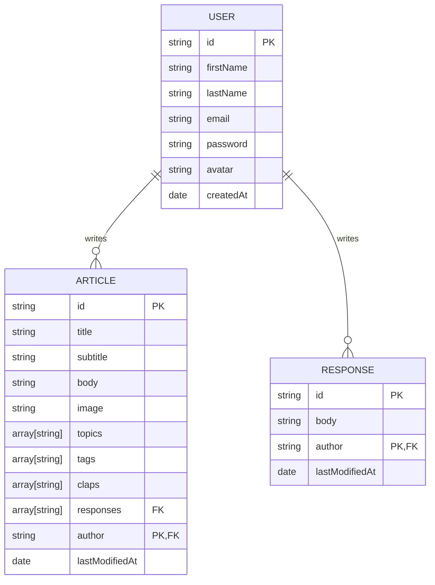

# Fedium

Platform where your ideas meet the world.

## ERD

## End Points

- `GET /user/` - Get all users
- `GET /user/:id` - Get a user
- `GET /user/:id/articles` - Get all articles by user
- `GET /user/:id/articles/:id` - Get a article by user
